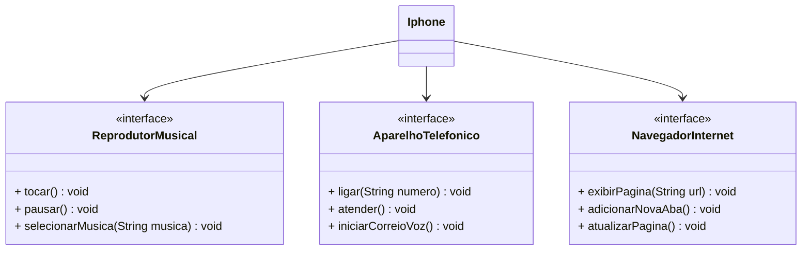

# Desafio de POO

### Modelagem e Diagramação de um Componente Iphone
Nesse desafio, implementamos um componente simples Iphone com objetivo de praticar a diagramação UML e os conceitos de interface e classe.

#### Funcionalidades
1. **Reprodutor Musical**
   - Métodos: `tocar()`, `pausar()`, `selecionarMusica(String musica)`
2. **Aparelho Telefônico**
    - Métodos: `ligar(String numero)`, `atender()`, `iniciarCorreioVoz()`
3. **Navegador na Internet**
    - Métodos: `exibirPagina(String url)`, `adicionarNovaAba()`, `atualizarPagina()`

#### Diagrama UML

